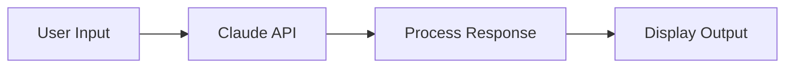
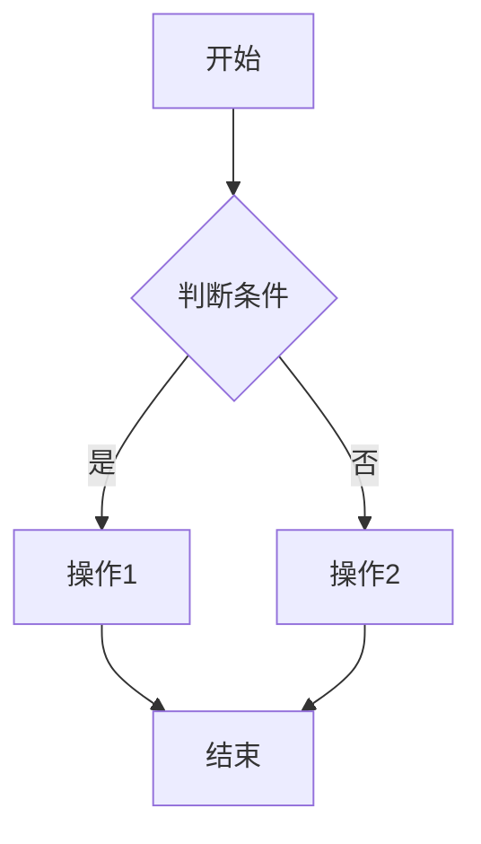
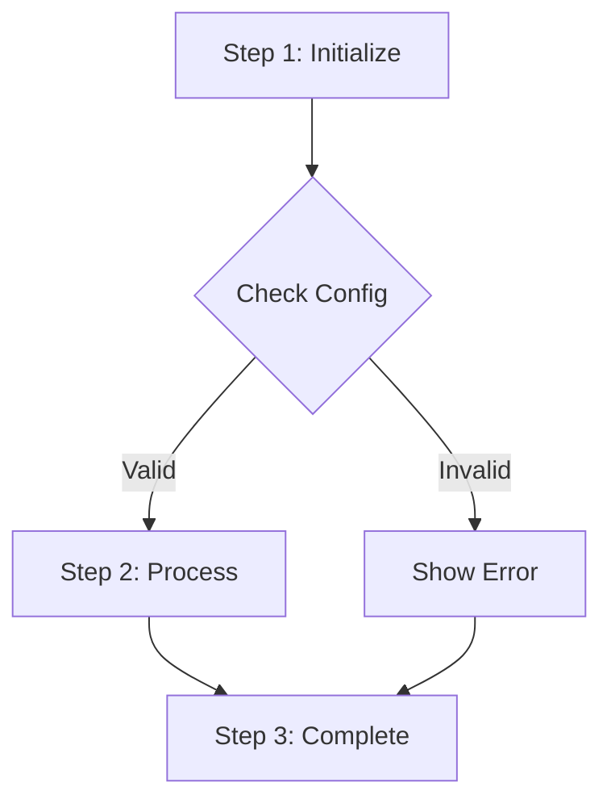
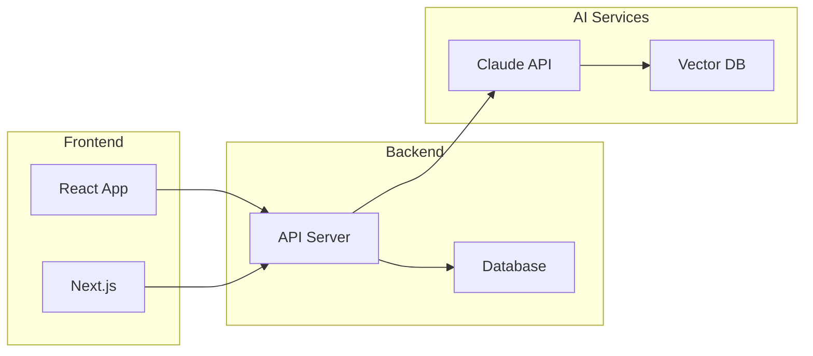
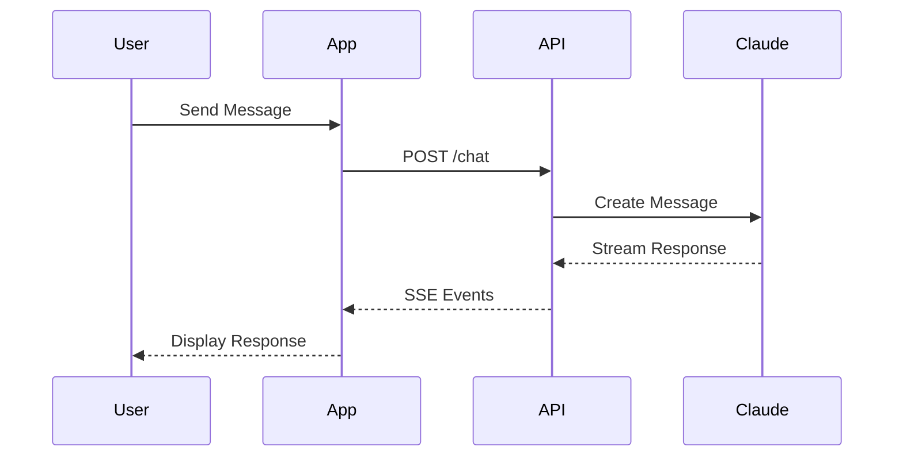
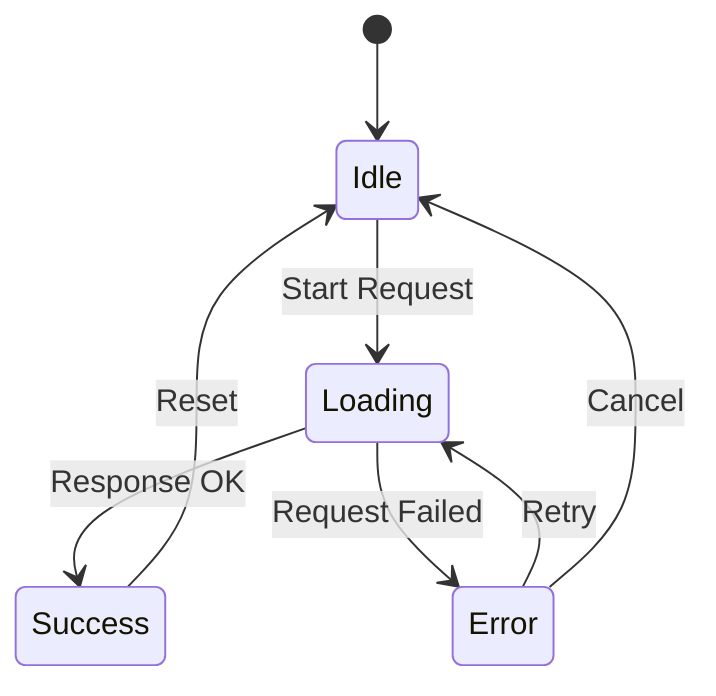
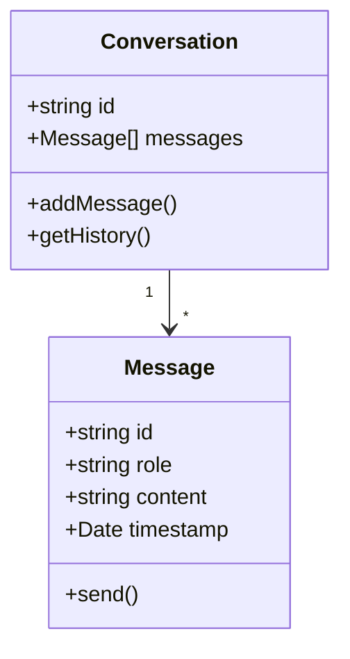

# Visual Guidelines

Image templates, placement rules, and alt text best practices.

---

## MDX Image Templates

### Standard Image with Caption
```mdx
<figure className="my-8">
  
  <figcaption className="mt-2 text-center text-sm text-gray-600 dark:text-gray-400">
    [Caption explaining what the image shows]
  </figcaption>
</figure>
```

### Hero Image (Full Width)
```mdx
<figure className="my-8 -mx-4 md:-mx-8">
  
  <figcaption className="mt-2 text-center text-sm text-gray-600 dark:text-gray-400 px-4">
    [Caption]
  </figcaption>
</figure>
```

### Side-by-Side Comparison
```mdx
<div className="grid grid-cols-1 md:grid-cols-2 gap-4 my-8">
  <figure>
    
    <figcaption className="mt-2 text-center text-sm text-gray-600 dark:text-gray-400">
      Before: [description]
    </figcaption>
  </figure>
  <figure>
    
    <figcaption className="mt-2 text-center text-sm text-gray-600 dark:text-gray-400">
      After: [description]
    </figcaption>
  </figure>
</div>
```

### Screenshot with Border
```mdx
<figure className="my-8">
  
  <figcaption className="mt-2 text-center text-sm text-gray-600 dark:text-gray-400">
    Screenshot: [What this demonstrates]
  </figcaption>
</figure>
```

---

## Image Placement Rules

### Where to Insert Images

| Position | Purpose | Image Type |
|----------|---------|------------|
| After intro | Set context, grab attention | Hero, conceptual |
| Before complex section | Prepare reader | Diagram, overview |
| After explanation | Reinforce understanding | Example, screenshot |
| At data points | Visualize statistics | Chart, infographic |
| Before conclusion | Summarize visually | Summary graphic |

### Spacing Guidelines
- **Minimum**: 2-3 paragraphs between images
- **Maximum**: No more than 500 words without visual break
- **Exception**: Code-heavy sections may have tighter image spacing

### Image Density by Article Type

| Article Type | Images per 1000 words |
|--------------|----------------------|
| Tutorial | 3-5 |
| Explanation | 2-3 |
| Opinion/Analysis | 1-2 |
| News/Update | 1-2 |

---

## Alt Text Best Practices

### Structure
```
[Subject] + [Action/State] + [Context/Purpose]
```

### Examples

**Good:**
```
alt="Claude AI dashboard showing conversation history and model selection dropdown"
```

**Bad:**
```
alt="screenshot" ❌
alt="image1.png" ❌
alt="a picture of the Claude interface" ❌
```

### Guidelines
1. **Be specific**: Describe what's actually shown
2. **Include context**: Why is this image here?
3. **Use keywords naturally**: Don't keyword stuff
4. **Length**: 50-125 characters ideal
5. **No "image of"**: Start directly with content

### Alt Text by Image Type

| Type | Pattern | Example |
|------|---------|---------|
| Screenshot | [UI name] showing [feature] | "VS Code editor showing MCP configuration file" |
| Diagram | [Diagram type] of [concept] | "Flowchart of the AI agent decision process" |
| Chart | [Chart type] comparing [metrics] | "Bar chart comparing response times across AI models" |
| Code output | [Language/tool] output showing [result] | "Terminal output showing successful API response" |

---

## Diagram Recommendations

### When to Use Diagrams

| Concept Type | Recommended Diagram |
|--------------|-------------------|
| Process/workflow | Flowchart |
| System architecture | Block diagram |
| Relationships | Entity diagram |
| Comparisons | Side-by-side or matrix |
| Timeline | Horizontal timeline |
| Hierarchy | Tree diagram |

### ASCII Diagram Template (for inline use)
```
┌─────────┐     ┌─────────┐     ┌─────────┐
│  Input  │────▶│ Process │────▶│ Output  │
└─────────┘     └─────────┘     └─────────┘
```

### Mermaid Diagram (if supported)


---

## Mermaid图表自动生成

根据文章内容类型，自动选择合适的Mermaid图表模板。

### 流程图 (Flowchart) - 步骤说明

适用于：教程步骤、决策过程、工作流程



**MDX嵌入语法：**
````mdx

````

### 架构图 (Architecture) - 系统概览

适用于：系统设计、技术栈、组件关系



### 时序图 (Sequence) - 交互流程

适用于：API调用、用户交互、系统通信



### 状态图 (State) - 生命周期

适用于：状态机、生命周期、流程状态



### 类图 (Class) - 数据结构

适用于：对象关系、类型定义、数据模型



### 图表选择指南

| 内容类型 | 推荐图表 | 使用场景 |
|---------|---------|---------|
| 教程步骤 | flowchart TD | "如何配置...", "步骤1-2-3" |
| 系统架构 | flowchart LR + subgraph | "架构设计", "技术栈" |
| API调用 | sequenceDiagram | "请求流程", "用户交互" |
| 状态变化 | stateDiagram-v2 | "状态机", "生命周期" |
| 数据模型 | classDiagram | "类型定义", "对象关系" |
| 时间线 | timeline | "发展历程", "里程碑" |
| 思维导图 | mindmap | "概念梳理", "知识体系" |

---

## 免费图库指南

### 推荐图库

| 图库 | 特点 | 许可证 | 最佳用途 |
|------|------|--------|---------|
| [Unsplash](https://unsplash.com) | 高质量摄影 | 免费商用，无需归属 | Hero图、背景 |
| [Pexels](https://pexels.com) | 综合素材 | 免费商用，无需归属 | 通用配图 |
| [Pixabay](https://pixabay.com) | 插画丰富 | 免费商用，无需归属 | 概念插画 |
| [unDraw](https://undraw.co) | 技术插画 | 免费商用，可自定义颜色 | 技术博客 |
| [DrawKit](https://drawkit.com) | 现代插画 | 免费/付费版本 | 科技风格 |
| [Humaaans](https://humaaans.com) | 人物插画 | 免费商用 | 用户相关 |

### 搜索关键词策略

**技术文章：**
- `coding workspace`, `developer desk`, `programming abstract`
- `technology minimal`, `code on screen`, `software development`

**AI/机器学习：**
- `artificial intelligence concept`, `neural network visualization`
- `robot technology`, `futuristic tech`, `machine learning abstract`

**教程类：**
- `learning concept`, `education technology`, `step by step`
- `workspace setup`, `computer screen mockup`

**对比/分析类：**
- `comparison chart`, `versus concept`, `side by side`
- `data visualization`, `analytics dashboard`

### 图片归属格式 (可选但推荐)

```markdown
Photo by [Photographer Name](https://unsplash.com/@username) on [Unsplash](https://unsplash.com)
```

**MDX中使用：**
```mdx
<figure className="my-8">
  
  <figcaption className="mt-2 text-center text-sm text-gray-600 dark:text-gray-400">
    Photo by <a href="https://unsplash.com/@photographer">Photographer</a> on Unsplash
  </figcaption>
</figure>
```

### API使用示例 (可选)

**Unsplash API搜索：**
```bash
curl "https://api.unsplash.com/search/photos?query=artificial+intelligence&per_page=5" \
  -H "Authorization: Client-ID YOUR_ACCESS_KEY"
```

**Pexels API搜索：**
```bash
curl "https://api.pexels.com/v1/search?query=technology&per_page=5" \
  -H "Authorization: YOUR_API_KEY"
```

---

## AI图片生成提示词

### Hero概念图

**通用科技风格：**
```
A minimalist tech illustration showing [主题/概念],
modern flat design with subtle gradients,
purple and blue color scheme,
clean white background,
professional blog header style,
8k resolution
```

**示例 - AI Agent：**
```
A minimalist tech illustration showing an AI assistant robot
helping developers write code,
modern flat design with subtle gradients,
purple and blue color scheme on dark background,
professional blog header style,
geometric abstract elements, 8k resolution
```

**示例 - API集成：**
```
Abstract visualization of API connections and data flow,
isometric style with connected nodes and pathways,
neon blue and purple accents on dark background,
futuristic tech aesthetic,
clean minimal composition, 8k resolution
```

### 技术架构图

```
Technical diagram showing [系统名称] architecture,
isometric 3D style with labeled components,
dark theme with neon cyan and magenta accents,
professional documentation style,
clean grid layout, high detail, 8k resolution
```

**示例 - 微服务架构：**
```
Technical diagram showing microservices architecture
with API gateway, multiple services and database,
isometric 3D blocks connected by glowing data streams,
dark navy background with neon blue accents,
labeled components, professional tech documentation style
```

### 对比图

```
Side by side comparison visual showing [概念A] vs [概念B],
split screen design with contrasting colors,
left side showing [旧方案] in muted tones,
right side showing [新方案] in vibrant colors,
minimal icons and labels, professional infographic style
```

### 数据可视化概念图

```
Abstract data visualization showing [数据类型],
flowing data streams and chart elements,
gradient from purple to blue,
dark background with glowing elements,
futuristic analytics dashboard aesthetic, 8k resolution
```

### 风格指南

| 风格 | 关键词 | 适用场景 |
|------|--------|---------|
| 科技简约 | `minimalist, clean, modern, flat design` | 教程、指南 |
| 未来感 | `futuristic, neon, cyber, holographic` | AI、前沿技术 |
| 等距立体 | `isometric, 3D blocks, geometric` | 架构、系统设计 |
| 渐变抽象 | `gradient, abstract, flowing, smooth` | Hero图、概念 |
| 线条图 | `line art, wireframe, blueprint` | 技术文档 |

### 提示词优化技巧

1. **指定分辨率**: 添加 `8k resolution`, `high detail`, `4k`
2. **声明用途**: `blog header`, `article illustration`, `tech documentation`
3. **颜色方案**: 明确指定 `purple and blue`, `dark theme`, `white background`
4. **避免的词**: 不要使用 `realistic photo`, `stock image`, 人脸相关
5. **风格一致性**: 同一篇文章使用相似的风格描述

### 按文章类型的提示词模板

**教程类：**
```
Step by step tutorial illustration for [主题],
numbered steps with icons,
clean flat design, blue and white color scheme,
educational infographic style, 8k resolution
```

**对比评测类：**
```
Comparison infographic of [产品A] vs [产品B],
split design with feature icons,
professional tech review style,
balanced color scheme showing both options, 8k resolution
```

**概念解释类：**
```
Conceptual illustration explaining [概念],
abstract visual metaphor with [具体比喻],
soft gradient background,
simple iconic elements,
educational illustration style, 8k resolution
```

---

## File Naming Conventions

### Pattern
```
[article-slug]-[descriptor]-[number].png
```

### Examples
```
mcp-guide-architecture-01.png
ai-agents-workflow-diagram-01.png
claude-api-response-screenshot-01.png
```

### Directory Structure
```
public/images/
├── blog/
│   ├── [article-slug]/
│   │   ├── hero.png
│   │   ├── diagram-01.png
│   │   └── screenshot-01.png
```

---

## Image Optimization

### Technical Requirements
- **File size**: Aim for <200KB
- **Dimensions**: Max 1200px width
- **Format**: WebP preferred, PNG for screenshots, JPEG for photos
- **Compression**: Use tools like TinyPNG or ImageOptim

### Performance Tips
- Specify width and height to prevent layout shift
- Use lazy loading for images below the fold
- Consider responsive images with srcset

---

## Image Suggestion Output Format

When analyzing articles, suggest images in this format:

```markdown
## Image Suggestions

### Position 1: After Introduction
- **Type**: Hero/conceptual image
- **Suggested content**: [Description of what the image should show]
- **Alt text**: [SEO-optimized alt text]
- **Why**: [Reason this image helps at this location]

### Position 2: Section "Getting Started"
- **Type**: Diagram/flowchart
- **Suggested content**: [Description]
- **Alt text**: [Alt text]
- **Why**: [Reason]

### Position 3: Before "Common Issues"
- **Type**: Screenshot
- **Suggested content**: [Description]
- **Alt text**: [Alt text]
- **Why**: [Reason]
```

---

## Quality Checklist

Before adding images:

- [ ] Compressed for web (aim for <200KB)
- [ ] Appropriate dimensions (max 1200px width)
- [ ] Alt text is descriptive and SEO-friendly
- [ ] Caption explains significance
- [ ] File named descriptively
- [ ] Placed at logical break point
- [ ] MDX syntax is correct
- [ ] Image enhances understanding (not decorative)
