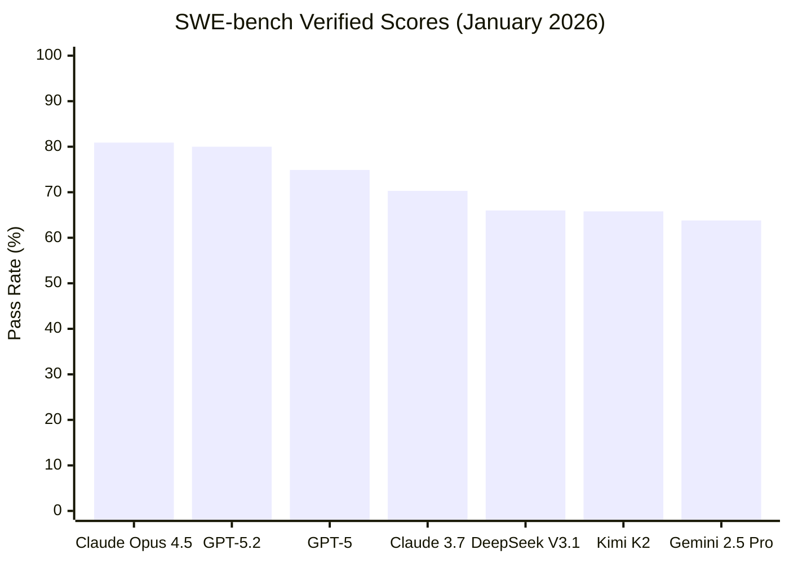
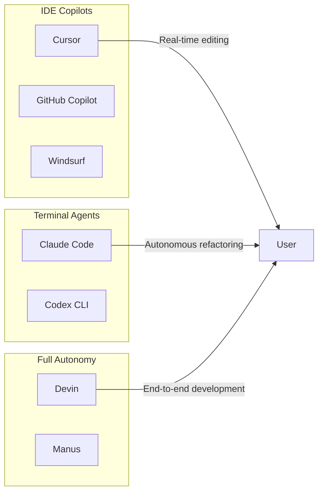

# LLM Coding Benchmark Showdown 2026: Who Actually Codes Best?

*Published: February 1, 2026*

Here's a stat that should make every developer pay attention: the gap between the best and worst frontier models on [SWE-bench Verified](https://www.swebench.com/viewer.html) is now over **50 percentage points**. Claude Opus 4.5 hits 80.9%. Some models barely crack 30%.

Choosing the wrong model isn't just inefficient—it's the difference between an AI that ships working code and one that creates more bugs than it fixes.

I spent the past week digging through every major coding benchmark, developer survey, and real-world comparison I could find. This is what the data actually says about which LLMs code best in 2026.

## Key Takeaways

- **Claude Opus 4.5** leads real-world coding at 80.9% on SWE-bench Verified—the first model to break 80%
- **GPT-5.2** dominates mathematical reasoning with perfect scores on AIME 2025, but trails Claude on code quality
- **Gemini 2.5 Pro** offers the largest context window (1M tokens) for whole-codebase comprehension
- **Open-source models** (Kimi K2.5, Qwen3-Coder) now rival proprietary options at 3-10x lower cost
- **DeepSeek V3.1** shows impressive benchmark scores (66% SWE-bench) but mixed real-world reviews
- The "best" model depends on your task: debugging, prototyping, or architecture

## The Benchmark Landscape in 2026

Before comparing models, let's understand what these benchmarks actually measure:

| Benchmark | What It Tests | Why It Matters |
|-----------|---------------|----------------|
| **SWE-bench Verified** | Real GitHub bug fixes | Gold standard for production coding |
| **LiveCodeBench** | Competitive programming | Algorithm and problem-solving ability |
| **HumanEval/MBPP** | Basic function generation | Saturated—most models score 90%+ |
| **Terminal-Bench** | Command-line proficiency | CLI and DevOps capabilities |
| **Aider Polyglot** | Multi-language editing | Real-world diff generation |

The industry has shifted from HumanEval (where [most models now score near-perfect](https://www.datacamp.com/tutorial/humaneval-benchmark-for-evaluating-llm-code-generation-capabilities)) to SWE-bench as the true test of coding ability. As noted by [Evidently AI](https://www.evidentlyai.com/blog/llm-coding-benchmarks), "excelling in algorithmic tasks doesn't always translate into full-stack engineering capabilities."

## Head-to-Head: The 2026 Leaderboard

### SWE-bench Verified (Real-World Bug Fixing)

The [SWE-bench Verified benchmark](https://www.vals.ai/benchmarks/swebench) represents the most realistic test of coding ability—500 actual GitHub issues that require understanding codebases, identifying bugs, and generating working patches.

**Key findings:**
- [Claude Opus 4.5 leads at 80.9%](https://www.datacamp.com/blog/claude-opus-4-5)—the first model to exceed 80%
- [GPT-5.2 follows closely at 80.0%](https://vertu.com/lifestyle/claude-opus-4-5-vs-gpt-5-2-codex-head-to-head-coding-benchmark-comparison/)
- The [0.9% gap](https://composio.dev/blog/claude-4-5-opus-vs-gemini-3-pro-vs-gpt-5-codex-max-the-sota-coding-model) represents about 4-5 additional solved issues

### LiveCodeBench (Algorithmic Problem Solving)

[LiveCodeBench](https://livecodebench.github.io/) continuously collects problems from LeetCode, AtCoder, and Codeforces—making it resistant to training data contamination.

| Model | Score | Notes |
|-------|-------|-------|
| Doubao-Seed-1.8 | 75% | Current leader |
| GPT-5.2 | ~89% | With extended reasoning |
| GLM-4.7 Thinking | 89% | Open-source, free to self-host |
| Gemini 2.5 Pro | 70.4% | Solid but not leading |
| Claude Opus 4.5 | 85%+ | Strong across all difficulty levels |

According to [LM Council benchmarks](https://lmcouncil.ai/benchmarks), "most of the top 10 performers on LiveCodeBench are flagship reasoning models like OpenAI's GPT 5.1, Google's Gemini 3 Pro, and o3."

### Terminal-Bench (Command-Line Proficiency)

This benchmark reveals the largest performance gap between top models:

- **Claude Opus 4.5**: 59.3%
- **GPT-5.2**: ~47.6%

That [11.7 percentage point difference](https://vertu.com/lifestyle/claude-opus-4-5-vs-gpt-5-2-codex-head-to-head-coding-benchmark-comparison/) shows Claude's particular strength in DevOps and CLI tasks—critical for agentic coding workflows.

## Model Deep Dives

### Claude Opus 4.5: The Code Quality Champion

**Strengths:**
- Leads 7 of 8 languages in [SWE-bench Multilingual](https://composio.dev/blog/claude-4-5-opus-vs-gemini-3-pro-vs-gpt-5-codex-max-the-sota-coding-model)
- Best-in-class code review and debugging
- "Thinking mode" supports 30+ minute reasoning sessions
- [#1 on WebDev Arena](https://whatllm.org/blog/best-coding-models-january-2026) for frontend development

**Weaknesses:**
- Highest cost at $15/M tokens
- Slower than GPT-5.2 for quick queries

**Best for:** Complex refactoring, code review, debugging legacy systems

Real-world feedback from [DEV Community testing](https://dev.to/tensorlake/claude-opus-45-vs-gpt-52-high-vs-gemini-3-pro-production-coding-test-25of): "Claude Opus 4.5 was the most consistent overall. It shipped working results for both tasks, and the UI polish was the best of the three."

### GPT-5.2: The Mathematical Reasoning Powerhouse

**Strengths:**
- Perfect 100% on AIME 2025 mathematical reasoning
- State-of-the-art on SWE-bench Pro (56.4%)
- Faster iteration with "Instant" variant for quick queries
- [Better autocomplete](https://vertu.com/lifestyle/gpt-5-2-high-vs-claude-opus-4-5-thinking-for-coding-which-ai-wins-in-cursor/) in IDE integrations

**Weaknesses:**
- Premium pricing ($75/M tokens for full reasoning)
- Occasionally over-engineers solutions

**Best for:** Algorithm development, mathematical code, rapid prototyping

[OpenAI reports](https://openai.com/index/introducing-gpt-5/) that GPT-5 performs "50-80% fewer output tokens" than o3 while maintaining quality—significant for cost management.

### Gemini 2.5 Pro: The Context Window King

**Strengths:**
- **1 million token context window**—5x larger than competitors
- [#1 on WebDev Arena](https://developers.googleblog.com/en/gemini-2-5-pro-io-improved-coding-performance/) for building web apps
- Strong front-end and UI development
- 92% on AIME 2024 single-attempt

**Weaknesses:**
- Trails Claude on SWE-bench (63.8% vs 80.9%)
- Reasoning can be less consistent

**Best for:** Large codebase comprehension, full-project refactoring, documentation

[Cognition (Devin's creators)](https://www.datacamp.com/blog/gemini-2-5-pro) noted: "The updated Gemini 2.5 Pro achieves leading performance on our junior-dev evals. It was the first-ever model that solved one of our evals involving a larger refactor."

### DeepSeek V3.1: The Value Contender

**Strengths:**
- 66% on SWE-bench Verified (outperforming R1-0528's 44.6%)
- Excellent tool usage for agentic workflows
- [Significantly cheaper](https://www.bentoml.com/blog/the-complete-guide-to-deepseek-models-from-v3-to-r1-and-beyond) than Western competitors
- Strong at "clean markdown" and documentation tasks

**Weaknesses:**
- [Mixed real-world reviews](https://eval.16x.engineer/blog/deepseek-v3-1-coding-performance-evaluation)—average rating of 5.68/10 in independent testing
- Performs worse than Qwen3-Coder and Kimi K2 in some evaluations

**Best for:** Budget-conscious teams, documentation, Chinese language support

### Open-Source Leaders: Kimi K2.5 & Qwen3-Coder

The open-source ecosystem has matured dramatically. [Kimi K2.5](https://huggingface.co/moonshotai/Kimi-K2.5) (released January 2026) brings impressive capabilities:

| Model | SWE-bench | Key Feature |
|-------|-----------|-------------|
| Kimi K2.5 | ~70% | Agent Swarm (100 parallel sub-agents) |
| Kimi K2 | 65.8% | 1T params, 32B active |
| Qwen3-Coder-480B | ~60% | Multiple size variants |
| GLM-4.7 Thinking | 89% (LiveCodeBench) | Free self-hosting |

[VentureBeat reports](https://venturebeat.com/ai/alibabas-new-open-source-qwen3-235b-a22b-2507-beats-kimi-2-and-offers-low-compute-version/) that the latest Qwen3 variant "outperforms Claude Opus 4 and Kimi K2 on benchmarks like GPQA, AIME25, and Arena-Hard v2."

**Cost comparison** from [Clarifai analysis](https://www.clarifai.com/blog/kimi-k2-vs-qwen-3-vs-glm-4.5): "Using Western models might cost $2,500–$15,000 monthly for 1B tokens. By adopting GLM 4.5 or Kimi K2, the same workload could cost $110–$150."

## The Coding Tools Ecosystem

Benchmarks only tell part of the story. How you access these models matters too:

### Claude Code vs Cursor: Complementary, Not Competing

According to [extensive 2026 comparisons](https://northflank.com/blog/claude-code-vs-cursor-comparison):

| Aspect | Cursor | Claude Code |
|--------|--------|-------------|
| Philosophy | "You drive, AI assists" | "AI drives, you supervise" |
| Context | 70-120K effective tokens | Full 200K tokens |
| Strength | Real-time editing, polish | Multi-file refactoring |
| Interface | VS Code-based IDE | Terminal CLI |
| Price | $20/month Pro | $20/month (usage-based) |

[Developer consensus](https://medium.com/data-science-in-your-pocket/claude-code-vs-cursor-97b446515d83): "Use Cursor for exploratory work and quick edits. Use Claude Code for documentation, test suites, large refactors, and tasks where you value thoroughness over speed."

## Practical Recommendations

### By Use Case

| Task | Recommended Model | Why |
|------|-------------------|-----|
| Bug fixing | Claude Opus 4.5 | 80.9% SWE-bench, best accuracy |
| Algorithm problems | GPT-5.2 | Perfect AIME scores |
| Full codebase work | Gemini 2.5 Pro | 1M token context |
| Budget development | Kimi K2.5 / Qwen3 | 10-30x cheaper |
| Quick prototyping | GPT-5.2 Instant | Low latency |
| Code review | Claude Opus 4.5 | Superior feedback quality |

### By Budget

| Monthly Budget | Recommendation |
|----------------|----------------|
| Free | Kimi K2.5 (self-hosted), Qwen3 |
| $20/month | Cursor or Claude Code subscription |
| $100/month | Claude Sonnet 4.5 API (best value) |
| Enterprise | Claude Opus 4.5 + GPT-5.2 hybrid |

### The Hybrid Approach

[Developer surveys](https://codingwithroby.substack.com/p/cursor-vs-claude-code-why-top-developers) show top developers increasingly use multiple tools:

1. **Cursor** for day-to-day coding and quick iterations
2. **Claude Code** for large refactors and autonomous tasks
3. **GPT-5.2** when mathematical reasoning is critical
4. **Gemini 2.5 Pro** for understanding unfamiliar large codebases

## What the Benchmarks Don't Tell You

Numbers don't capture everything:

**Consistency matters more than peak performance.** A model that scores 70% reliably beats one that oscillates between 40% and 90%.

**Scaffolding affects results.** [SWE-bench scores depend heavily](https://artificialanalysis.ai/leaderboards/models) on the agentic scaffold used. Claude Code and Cursor achieve different results with the same underlying model.

**Latency is invisible in benchmarks.** GPT-5.2's reasoning mode can take minutes for complex problems. For interactive coding, faster models often win.

**Training data contamination is real.** LiveCodeBench continuously adds new problems specifically to avoid this—[a major advantage](https://livecodebench.github.io/) over static benchmarks.

## The Bottom Line

The 2026 coding AI landscape has three clear tiers:

**Tier 1 - Premium Leaders:**
- Claude Opus 4.5 (code quality champion)
- GPT-5.2 (reasoning powerhouse)

**Tier 2 - Specialized Excellence:**
- Gemini 2.5 Pro (context window king)
- Gemini 3 Pro (visual reasoning leader)

**Tier 3 - Value Champions:**
- Kimi K2.5 (open-source leader)
- Qwen3-Coder (Alibaba's contender)
- DeepSeek V3.1 (budget option with caveats)

The question isn't "which model is best?"—it's "which model is best for *your* specific workflow, budget, and task requirements?"

For most developers, starting with a Cursor or Claude Code subscription ($20/month) provides the best balance of capability and cost. As your needs grow, add specialized models for specific tasks.

The AI coding revolution isn't about finding one perfect tool. It's about building the right stack.

---

## Sources

- [LM Council Benchmarks January 2026](https://lmcouncil.ai/benchmarks)
- [WhatLLM Best Coding Models January 2026](https://whatllm.org/blog/best-coding-models-january-2026)
- [SWE-bench Results Viewer](https://www.swebench.com/viewer.html)
- [Anthropic Claude SWE-Bench Performance](https://www.anthropic.com/research/swe-bench-sonnet)
- [OpenAI Introducing GPT-5](https://openai.com/index/introducing-gpt-5/)
- [Google Gemini 2.5 Pro Developer Blog](https://developers.googleblog.com/en/gemini-2-5-pro-io-improved-coding-performance/)
- [Claude Opus 4.5 vs GPT-5.2 Coding Comparison](https://vertu.com/lifestyle/claude-opus-4-5-vs-gpt-5-2-codex-head-to-head-coding-benchmark-comparison/)
- [DeepSeek V3.1 Coding Evaluation](https://eval.16x.engineer/blog/deepseek-v3-1-coding-performance-evaluation)
- [Kimi K2.5 on Hugging Face](https://huggingface.co/moonshotai/Kimi-K2.5)
- [Claude Code vs Cursor Comparison](https://northflank.com/blog/claude-code-vs-cursor-comparison)
- [LiveCodeBench Leaderboard](https://livecodebench.github.io/leaderboard.html)
- [Artificial Analysis Model Leaderboards](https://artificialanalysis.ai/leaderboards/models)
